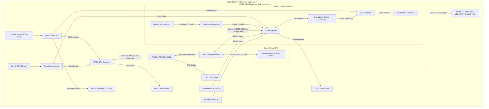
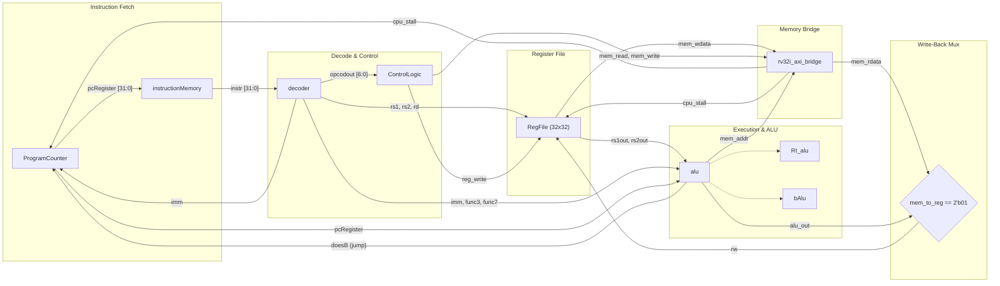
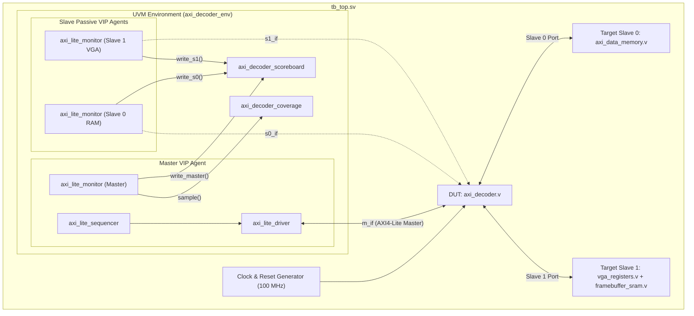

# RV32I Processor Core with AXI-4 Interconnect & VGA Subsystem

A complete 32-bit RISC-V (RV32I Base Integer ISA) System-on-Chip (SoC) implemented in synthesizable Verilog HDL. The system integrates a custom single-cycle RV32I microprocessor core, an AXI4-Lite bus interconnect, memory-mapped I/O, an on-chip dual-port video framebuffer controller, and an interactive bare-metal Ping Pong game.

The design features a dual deployment target:
1. **FPGA Implementation**: Synthesized and deployed to the **Digilent Zybo Z7-10** FPGA using the fully open-source **F4PGA / SymbiFlow** toolchain.
2. **ASIC Physical Design (GDSII)**: Hardened down to silicon layout on the **SkyWater 130nm (`sky130_fd_sc_hd`)** process node using the automated open-source **OpenLane / OpenROAD** physical design flow, achieving 0 DRC errors, 0 LVS errors, and clean multi-corner timing closure.
3. **UVM 1.2 Verification Environment**: Industrial-grade SystemVerilog UVM testbench verifying the AXI4-Lite crossbar interconnect, memory routing, and error slave responses with >93% functional coverage.

---

## Table of Contents

- [Overview](#overview)
- [System Architecture](#system-architecture)
- [Memory Map & Interconnect](#memory-map--interconnect)
- [Microprocessor Core (RV32I)](#microprocessor-core-rv32i)
  - [Datapath Architecture](#datapath-architecture)
  - [Supported Instruction Set](#supported-instruction-set)
  - [Control Logic Unit](#control-logic-unit)
  - [Core Module Breakdown](#core-module-breakdown)
- [On-Chip Interconnect & AXI4-Lite Bridge](#on-chip-interconnect--axi4-lite-bridge)
  - [RV32I to AXI4-Lite Bridge](#rv32i-to-axi4-lite-bridge)
  - [AXI Crossbar Decoder](#axi-crossbar-decoder)
  - [AXI Data Memory](#axi-data-memory)
- [VGA Graphics Controller Subsystem](#vga-graphics-controller-subsystem)
  - [Resolution & 4x Hardware Pixel Scaling](#resolution--4x-hardware-pixel-scaling)
  - [Framebuffer Architecture & BRAM Footprint](#framebuffer-architecture--bram-footprint)
  - [Memory-Mapped VGA Registers](#memory-mapped-vga-registers)
  - [Pmod RGB111 Physical Interface](#pmod-rgb111-physical-interface)
- [FPGA Implementation (Digilent Zybo Z7-10)](#fpga-implementation-digilent-zybo-z7-10)
  - [Clock & Reset Architecture](#clock--reset-architecture)
  - [Diagnostic LEDs & Peripheral Pinout](#diagnostic-leds--peripheral-pinout)
- [ASIC Physical Design & GDSII (SkyWater 130nm)](#asic-physical-design--gdsii-skywater-130nm)
  - [Physical Implementation & OpenLane Flow](#physical-implementation--openlane-flow)
  - [Chip Layout & GDSII Screenshots](#chip-layout--gdsii-screenshots)
  - [Tapeout & Physical Metrics Summary](#tapeout--physical-metrics-summary)
  - [Multi-Corner Static Timing Analysis (STA)](#multi-corner-static-timing-analysis-sta)
  - [Power & IR Drop Analysis](#power--ir-drop-analysis)
- [Bare-Metal Application: Ping Pong Game](#bare-metal-application-ping-pong-game)
  - [Game Mechanics & Features](#game-mechanics--features)
  - [Flicker-Free Rendering Engine](#flicker-free-rendering-engine)
  - [Assembling & Updating Software](#assembling--updating-software)
- [Verification & Simulation](#verification--simulation)
  - [Testbench Suite](#testbench-suite)
  - [UVM 1.2 Verification Environment](#uvm-12-verification-environment)
  - [Running UVM Test Suite](#running-uvm-test-suite)
  - [Running SoC Simulation](#running-soc-simulation)
- [Build System & Toolchain Guide](#build-system--toolchain-guide)
  - [Makefile Targets](#makefile-targets)
  - [Synthesizing & Generating Bitstream (F4PGA)](#synthesizing--generating-bitstream-f4pga)
  - [Board Programming (openFPGALoader)](#board-programming-openfpgaloader)
- [Repository File Structure](#repository-file-structure)
- [License](#license)

---

## Overview

This project implements an end-to-end computer system spanning from CPU instruction decoding to real-time video generation, physical user I/O, tapeout-ready silicon GDSII, and UVM 1.2 testbench verification:

- **CPU Core**: 32-bit single-cycle RISC-V (RV32I) processor core with pipeline stall support for memory transactions.
- **Bus Standard**: Standard AXI4-Lite protocol decoupling the CPU pipeline from peripheral timing.
- **Memory Architecture**: Separate 1 KB local Instruction Memory (ROM) and memory-mapped AXI Data Memory (RAM).
- **Video Subsystem**: Custom hardware VGA controller generating standard 640x480 @ 60 Hz timing, featuring a 160x120 internal frame buffer with 4x hardware pixel replication and single Pmod RGB111 output.
- **Interactive Bare-Metal Demo**: Real-time 2-player Ping Pong game (`pong.s`) featuring physics ball collision, paddle controls via physical pushbuttons, and an automated AI player toggleable via a slide switch.
- **FPGA Deployment**: Target platform Digilent Zybo Z7-10 (Xilinx Zynq-7000 `xc7z010clg400-1`) synthesized via open-source **F4PGA / SymbiFlow**.
- **ASIC Silicon Implementation**: Hardened down to GDSII layout on **SkyWater 130nm (`sky130_fd_sc_hd`)** via **OpenLane / OpenROAD** with 0 DRC, 0 LVS, and clean multi-corner timing closure across all 9 PVT corners.
- **UVM 1.2 Verification**: Complete SystemVerilog UVM environment with AXI4-Lite VIP, scoreboard checking, and >93% functional coverage.

---

## System Architecture



---

## Memory Map & Interconnect

The AXI4-Lite crossbar decoder ([`rtl/bus/axi_decoder.v`](file:///c:/Users/HSG/Desktop/rv32i-vga/rtl/bus/axi_decoder.v)) maps the 32-bit address space to system slaves:

| Address Range | Size | Slave Target | Description | Access |
| :--- | :---: | :---: | :--- | :---: |
| `0x0000_0000 - 0x0000_00FF` | 256 B | **Slave 0** | Core AXI Data Memory (Synchronous RAM) | R/W |
| `0x1000_0000 - 0x1000_001F` | 32 B | **Slave 1** | VGA Control, Status & I/O Registers | R/W |
| `0x5000_0000 - 0x5001_2BFF` | 76.8 KB | **Slave 1** | VGA Framebuffer Dual-Port Memory (160x120 x 4B) | R/W |
| *All Other Addresses* | — | **Error Slave** | Unmapped Space (generates `SLVERR` response) | R/W |

---

## Microprocessor Core (RV32I)

### Datapath Architecture

The processor core is a single-cycle implementation of the RV32I Base Integer ISA. To bridge single-cycle execution with multi-cycle AXI handshakes, the core features a synchronous pipeline stall input (`cpu_stall`). When `cpu_stall` is asserted by the AXI bridge during an outstanding read or write transaction, the Program Counter (`ProgramCounter.v`) and Register File (`RegFile.v`) hold their states until the bus transaction completes.



### Supported Instruction Set

The core natively executes all 37 base integer instructions of the RV32I ISA:

1. **R-Type**: `ADD`, `SUB`, `SLL`, `SLT`, `SLTU`, `XOR`, `SRL`, `SRA`, `OR`, `AND`
2. **I-Type ALU**: `ADDI`, `SLLI`, `SLTI`, `SLTIU`, `XORI`, `SRLI`, `SRAI`, `ORI`, `ANDI`
3. **I-Type Load**: `LW`
4. **S-Type Store**: `SW`
5. **B-Type Branch**: `BEQ`, `BNE`, `BLT`, `BGE`, `BLTU`, `BGEU`
6. **U-Type Upper Immediate**: `LUI`, `AUIPC`
7. **J-Type / I-Type Jumps**: `JAL`, `JALR`

### Control Logic Unit

The `ControlLogic` module combinatorially generates all internal control signals based on the instruction opcode:

| Opcode | Instruction Class | `reg_write` | `mem_read` | `mem_write` | `alu_src` | `mem_to_reg` | `branch` | `jump` | `alu_op` |
| :---: | :---: | :---: | :---: | :---: | :---: | :---: | :---: | :---: | :---: |
| `7'd51` (`0110011`) | R-Type ALU | `1` | `0` | `0` | `0` (rs2) | `2'b00` | `0` | `0` | `2'b10` |
| `7'd19` (`0010011`) | I-Type ALU | `1` | `0` | `0` | `1` (imm) | `2'b00` | `0` | `0` | `2'b10` |
| `7'd3` (`0000011`) | Load (LW) | `1` | `1` | `0` | `1` (imm) | `2'b01` | `0` | `0` | `2'b00` |
| `7'd35` (`0100011`) | Store (SW) | `0` | `0` | `1` | `1` (imm) | `2'b00` | `0` | `0` | `2'b00` |
| `7'd99` (`1100011`) | Branch (B-Type) | `0` | `0` | `0` | `0` (rs2) | `2'b00` | `1` | `0` | `2'b01` |
| `7'd55` (`0110111`) | LUI | `1` | `0` | `0` | `0` | `2'b11` | `0` | `0` | `2'b11` |
| `7'd23` (`0010111`) | AUIPC | `1` | `0` | `0` | `1` (imm) | `2'b00` | `0` | `0` | `2'b00` |
| `7'd111` (`1101111`) | JAL | `1` | `0` | `0` | `0` | `2'b10` | `0` | `1` | `2'b00` |
| `7'd103` (`1100111`) | JALR | `1` | `0` | `0` | `1` (imm) | `2'b10` | `0` | `1` | `2'b00` |

### Core Module Breakdown

| Module | File | Function |
| :--- | :--- | :--- |
| `Datapath` | [`rtl/rv32i/Datapath.v`](file:///c:/Users/HSG/Desktop/rv32i-vga/rtl/rv32i/Datapath.v) | Core top-level connecting PC, memory, register file, ALU, decoder, and stall control. |
| `ProgramCounter` | [`rtl/rv32i/ProgramCounter.v`](file:///c:/Users/HSG/Desktop/rv32i-vga/rtl/rv32i/ProgramCounter.v) | Generates next PC (sequential `PC+4`, branch target `PC+imm`, JAL/JALR target). |
| `instructionMemory` | [`rtl/rv32i/instructionMemory.v`](file:///c:/Users/HSG/Desktop/rv32i-vga/rtl/rv32i/instructionMemory.v) | 1 KB byte-addressable ROM preloaded with `instructions.hex` via `$readmemh`. |
| `decoder` | [`rtl/rv32i/decoder.v`](file:///c:/Users/HSG/Desktop/rv32i-vga/rtl/rv32i/decoder.v) | Instruction field unbundling and sign-extended immediate generation. |
| `ControlLogic` | [`rtl/rv32i/ControlLogic.v`](file:///c:/Users/HSG/Desktop/rv32i-vga/rtl/rv32i/ControlLogic.v) | Opcode translation to datapath control signals. |
| `RegFile` | [`rtl/rv32i/RegFile.v`](file:///c:/Users/HSG/Desktop/rv32i-vga/rtl/rv32i/RegFile.v) | 32 x 32-bit register file (`x0`-`x31`) with asynchronous dual read and synchronous write. |
| `alu` | [`rtl/rv32i/alu.v`](file:///c:/Users/HSG/Desktop/rv32i-vga/rtl/rv32i/alu.v) | Top ALU routing arithmetic/logic, branches, effective addresses, AUIPC, LUI, and return links. |
| `RI_alu` | [`rtl/rv32i/RI_alu.v`](file:///c:/Users/HSG/Desktop/rv32i-vga/rtl/rv32i/RI_alu.v) | Integer R-type & I-type arithmetic and logic operations. |
| `bAlu` | [`rtl/rv32i/bAlu.v`](file:///c:/Users/HSG/Desktop/rv32i-vga/rtl/rv32i/bAlu.v) | Branch condition evaluation (BEQ, BNE, BLT, BGE, BLTU, BGEU). |
| `dataMemory` | [`rtl/rv32i/dataMemory.v`](file:///c:/Users/HSG/Desktop/rv32i-vga/rtl/rv32i/dataMemory.v) | Core local RAM model. |

---

## On-Chip Interconnect & AXI4-Lite Bridge

### RV32I to AXI4-Lite Bridge

The bridge ([`rtl/bus/rv32i_axi_bridge.v`](file:///c:/Users/HSG/Desktop/rv32i-vga/rtl/bus/rv32i_axi_bridge.v)) converts native CPU memory signals (`mem_addr`, `mem_wdata`, `mem_write`, `mem_read`) into standard AXI4-Lite master transactions:

- **State Machine**:
  - `IDLE`: Monitors `mem_read` and `mem_write`.
  - `WRITE`: Asserts `m_axi_awvalid` and `m_axi_wvalid`, captures address and data, waits for `awready` & `wready`.
  - `WRESP`: Waits for `m_axi_bvalid` from the slave, returns `bready`.
  - `READ`: Asserts `m_axi_arvalid`, captures read address, waits for `arready`.
  - `RDATA`: Waits for `m_axi_rvalid`, latches `rdata`, returns `rready`.
- **CPU Stall Generation**: Asserts `cpu_stall = 1'b1` during any non-IDLE state, freezing the CPU pipeline until the AXI transaction completes.

### AXI Crossbar Decoder

[`rtl/bus/axi_decoder.v`](file:///c:/Users/HSG/Desktop/rv32i-vga/rtl/bus/axi_decoder.v) decodes master addresses and routes traffic to the designated slave port:
- **Slave 0**: Data RAM (`0x0000_0000 - 0x0000_00FF`).
- **Slave 1**: VGA Registers (`0x1000_0000 - 0x1000_001F`) & Framebuffer (`0x5000_0000 - 0x5001_2BFF`).
- **Internal Error Slave**: Unmapped addresses are automatically trapped by the decoder, returning an AXI error response (`bresp = 2'b10 SLVERR` or `rresp = 2'b10 SLVERR`).

---

## VGA Graphics Controller Subsystem

```
+-------------------------------------------------------------------------------+
|                             VGA Subsystem (vga)                               |
|                                                                               |
|  +--------------------+   Port Arbitration   +----------------------+         |
|  |   vga_registers    |<====================>|   framebuffer_sram   |         |
|  | (MMIO & CPU Port)  |   (CPU vs VGA)       | (160x120 x 32-bit)   |         |
|  +--------------------+                      +----------------------+         |
|        |                                                |                     |
|   btn / sw inputs                                       v (32-bit pixel data) |
|        |                                     +----------------------+         |
|        |         +-------------------------->|    vga_controller    |         |
|        |         |  fb_req, fb_addr          +----------------------+         |
|        v         |                                      |                     |
|  +----------------------+                               v                     |
|  |    pixel_addr_gen    |                      +------------------+           |
|  | (4x Pixel Scaling)   |                      |    rgb_output    | (1-cycle  |
|  +----------------------+                      +------------------+  delay)   |
|        ^                                                |                     |
|        | H_count, V_count                               v                     |
|  +----------------------+                      VGA Output (Pmod JC)           |
|  |      vga_timing      |                      - RGB111 (R, G, B)             |
|  | (640x480 @ 60Hz Sync)|                      - HSync, VSync                 |
|  +----------------------+                                                     |
+-------------------------------------------------------------------------------+
```

### Resolution & 4x Hardware Pixel Scaling

- **Internal Resolution**: 160 x 120 pixels.
- **Physical Output Resolution**: Standard 640 x 480 @ 60 Hz VGA timing.
- **Hardware Scaling**: [`pixel_addr_gen.v`](file:///c:/Users/HSG/Desktop/rv32i-vga/rtl/vga/pixel_addr_gen.v) performs 4x horizontal and 4x vertical pixel replication (`H_count >> 2`, `V_count >> 2`). Every pixel written by the CPU to the 160x120 buffer is automatically rendered on display as a sharp 4x4 physical pixel block.

### Framebuffer Architecture & BRAM Footprint

- **Storage Format**: 32-bit word per pixel (`0x00RRGGBB`).
- **Memory Depth**: 160 * 120 = 19,200 words = 76,800 bytes.
- **BRAM Consumption**: Consumes only **17 Block RAMs (36Kb each)** on the Xilinx XC7Z010 FPGA (out of 60 available), leaving over **71% of on-chip RAM free** for CPU logic and other modules.
- **Access Arbitration**: [`vga_registers.v`](file:///c:/Users/HSG/Desktop/rv32i-vga/rtl/vga/vga_registers.v) arbitrates SRAM port access between CPU memory writes and real-time raster scanning.
- **Synchronous Pipeline Alignment**: HSync, VSync, and pixel data are passed through a 1-cycle delay pipeline (`vga_controller.v` and `rgb_output.v`) to align with synchronous Block RAM read latency.

### Memory-Mapped VGA Registers

Base Address: `0x1000_0000`

| Offset | Register Name | Access | Bit Field | Description |
| :---: | :--- | :---: | :---: | :--- |
| `0x00` | `VGA_CTRL` | R/W | `[0]` | **Display Enable** (`1` = Active video generation, `0` = Blank screen). |
| `0x04` | `VGA_STATUS` | R | `[0]` | **VBLANK Flag** (`1` during vertical retrace, ideal for screen synchronization). |
| `0x08` | `VGA_FB_BASE` | R/W | `[31:0]` | Framebuffer base memory address pointer (defaults to `0x5000_0000`). |
| `0x0C` | `VGA_RESOLUTION` | R | `[31:16] / [15:0]` | Resolution config: Height (120) in upper 16 bits, Width (160) in lower 16 bits. |
| `0x10` | `VGA_BTN` | R | `[3:0]` | Direct hardware pushbutton inputs (`BTN3`, `BTN2`, `BTN1`, `BTN0`). |
| `0x14` | `VGA_SW` | R | `[3:0]` | Direct hardware slide switch inputs (`SW3`, `SW2`, `SW1`, `SW0`). |

### Pmod RGB111 Physical Interface

The video output is mapped to a single Digilent Pmod port (**JC**) in 1-bit per channel RGB111 color mode:
- **Colors Supported**: 8 saturated colors (Black, Blue, Green, Cyan, Red, Magenta, Yellow, White).
- **Physical Pins**:
  - `vga_r`: JC1 (Pin V15)
  - `vga_g`: JC2 (Pin W15)
  - `vga_b`: JC3 (Pin T11)
  - `vga_hs`: JC7 (Pin W14)
  - `vga_vs`: JC8 (Pin Y14)

---

## FPGA Implementation (Digilent Zybo Z7-10)

The SoC top wrapper is implemented in [`rtl/fpga/zybo_top.v`](file:///c:/Users/HSG/Desktop/rv32i-vga/rtl/fpga/zybo_top.v) and constrained in [`constraints/zybo_z7_10.xdc`](file:///c:/Users/HSG/Desktop/rv32i-vga/constraints/zybo_z7_10.xdc).

### Clock & Reset Architecture

1. **Clock Generation**: The onboard 125.0 MHz oscillator (Pin K17) is divided by 5 via a counter with 50% duty cycle to produce a **25.0 MHz system clock** (`clk_25m`).
   - Standard 640x480 @ 60 Hz VGA requires 25.175 MHz; the 25.0 MHz clock is within standard monitor tolerance (< 0.7% drift).
   - The entire SoC (CPU, AXI crossbar, Framebuffer, and VGA rasterizer) runs synchronously on this 25.0 MHz domain.
2. **Reset Synchronizer**: Switch `sw[0]` is routed through a 3-stage shift-register synchronizer clocked at 25 MHz to eliminate metastability.

### Diagnostic LEDs & Peripheral Pinout

| Pin Type | Board Component | FPGA Pin | Direction | Function |
| :--- | :--- | :---: | :---: | :--- |
| **Clock** | 125 MHz Oscillator | `K17` | Input | System master clock input. |
| **Switch** | SW0 | `G15` | Input | **Hardware Reset** (`1` = In reset, `0` = Run). |
| **Switch** | SW1 | `P15` | Input | **AI Assist Toggle** (`0` = AI controls Right paddle, `1` = 2-Player Manual). |
| **Button** | BTN0 | `K18` | Input | **Left Paddle UP**. |
| **Button** | BTN1 | `P16` | Input | **Left Paddle DOWN**. |
| **Button** | BTN2 | `K19` | Input | **Right Paddle UP** (Manual Mode). |
| **Button** | BTN3 | `Y16` | Input | **Right Paddle DOWN** (Manual Mode). |
| **LED** | LED0 | `M14` | Output | **Display Active**: Solid ON when CPU enables display via MMIO. |
| **LED** | LED1 | `M15` | Output | **CPU Stall**: Indicates memory wait states. |
| **LED** | LED2 | `G14` | Output | **Memory Write**: Latches ON after first CPU memory write. |
| **LED** | LED3 | `D18` | Output | **System Heartbeat**: Blinks continuously at ~1.5 Hz. |
| **VGA Red** | Pmod JC Pin 1 | `V15` | Output | Red channel 1-bit digital output. |
| **VGA Green** | Pmod JC Pin 2 | `W15` | Output | Green channel 1-bit digital output. |
| **VGA Blue** | Pmod JC Pin 3 | `T11` | Output | Blue channel 1-bit digital output. |
| **VGA HSync** | Pmod JC Pin 7 | `W14` | Output | Horizontal Synchronization Pulse. |
| **VGA VSync** | Pmod JC Pin 8 | `Y14` | Output | Vertical Synchronization Pulse. |

---

## ASIC Physical Design & GDSII (SkyWater 130nm)

The entire `soc_top` design has been hardened down to silicon layout using the open-source **OpenLane / OpenROAD** automated physical design flow targeting the **SkyWater 130nm (`sky130_fd_sc_hd`)** process node.

### Physical Implementation & OpenLane Flow

The physical design flow executes all classical digital ASIC back-end stages autonomously:
1. **Logic Synthesis & Tech Mapping**: Yosys synthesizes RTL logic mapped to the `sky130_fd_sc_hd` standard cell library.
2. **Floorplanning & PDN**: Core and die boundaries are established, followed by power delivery network generation creating low-resistance upper-metal straps for `VPWR` and `VGND`.
3. **Placement & Optimization**: Global and detailed placement via OpenROAD, inserting tap cells, antenna diodes, and timing repair buffers.
4. **Clock Tree Synthesis (CTS)**: Automated clock tree synthesis constructing balanced clock buffers across all sequential flip-flops.
5. **Detailed Routing**: TritonRoute routes all signal nets across 5 metal layers, iteratively resolving DRC errors over 22 iterations.
6. **Physical Verification (DRC/LVS)**: Magic and KLayout verify design rule compliance and layout-versus-schematic netlist equivalence.
7. **Multi-Corner Static Timing Analysis (STA)**: Sign-off timing verification across 9 PVT corners with full parasitic extraction (SPEF).

### Chip Layout & GDSII Screenshots

#### 1. Static Timing Analysis Sign-off (9-Corner STA Table)
The layout achieved **zero hold violations and zero setup violations** across all process-voltage-temperature (PVT) corners with positive worst slacks:


---

#### 2. Full-Chip Routed Layout & Power Distribution Network (PDN)
OpenROAD layout visualization showing core standard cell rows, clock distribution buffers, horizontal/vertical power mesh straps, and peripheral I/O bond pads:


---

#### 3. KLayout GDSII Viewer (`soc_top.gds`)
Detailed KLayout inspection displaying the final mask geometry, standard cell macro placements (`sky130_fd_sc_hd`), and dedicated I/O pin assignments:


---

### Tapeout & Physical Metrics Summary

Key sign-off metrics extracted from [`gds/RUN_2026-09-11_10-33-07/final/metrics.json`](file:///c:/Users/HSG/Desktop/rv32i-vga/gds/RUN_2026-09-11_10-33-07/final/metrics.json):

| Metric Category | Parameter | Value | Sign-off Status |
| :--- | :--- | :---: | :---: |
| **Process Node** | Semiconductor PDK | **SkyWater 130nm** (`sky130_fd_sc_hd`) | Verified |
| **Die Dimensions** | Width x Height | **112.92 µm x 123.64 µm** | Tapeout Ready |
| **Die Area** | Total Die Footprint | **13,960.2 µm²** (0.014 mm²) | Passed |
| **Core Dimensions** | Width x Height | **107.18 µm x 111.52 µm** | Tapeout Ready |
| **Core Area** | Active Core Area | **10,231.1 µm²** | Passed |
| **Core Utilization** | Placement Density | **79.97%** (~80%) | Optimal |
| **Total Instances** | All Standard Cells & Physical Cells | **1,614 cells** | Clean |
| **Logic Cell Instances** | Functional Standard Cells | **925 cells** (8,181.6 µm²) | Clean |
| **Sequential Elements** | D-Flip-Flops / Latches | **111 cells** (2,766.4 µm²) | Clean |
| **Physical Cells** | Fill Cells / Tap Cells | **689 fill / 136 tap** | Clean |
| **Buffer Cells** | Timing Repair / Clock Buffers | **147 repair / 31 clock** | Clean |
| **Detailed Routing** | Total Routed Wirelength | **13,464 µm** (13.46 mm) | Completed (iter 22) |
| **Via Count** | Total Routing Vias | **4,670 vias** | Clean |
| **DRC Violations** | Detailed Routing DRC Errors | **0 errors** | **PASSED** |
| **LVS Violations** | Disconnected / Floating Pins | **0 errors** | **PASSED** |
| **Antenna Violations** | Violating Nets / Pins | **0 nets / 0 pins** | **PASSED** |

### Multi-Corner Static Timing Analysis (STA)

The design achieves clean timing closure across all 9 PVT analysis corners:

| Analysis Corner | Temp / Voltage | Setup Slack (WS) | Setup Vio | Hold Slack (WS) | Hold Vio | Max Slew Vio | Max Cap Vio |
| :--- | :---: | :---: | :---: | :---: | :---: | :---: | :---: |
| `nom_tt_025C_1v80` | +25°C / 1.80V | **+5.196 ns** | 0 | **+0.459 ns** | 0 | 0 | 0 |
| `nom_ss_100C_1v60` | +100°C / 1.60V | **+0.630 ns** | 0 | **+0.979 ns** | 0 | 0 | 0 |
| `nom_ff_n40C_1v95` | -40°C / 1.95V | **+6.248 ns** | 0 | **+0.257 ns** | 0 | 0 | 0 |
| `min_tt_025C_1v80` | +25°C / 1.80V | **+5.230 ns** | 0 | **+0.458 ns** | 0 | 0 | 0 |
| `min_ss_100C_1v60` | +100°C / 1.60V | **+0.713 ns** | 0 | **+0.976 ns** | 0 | 0 | 0 |
| `min_ff_n40C_1v95` | -40°C / 1.95V | **+6.270 ns** | 0 | **+0.256 ns** | 0 | 0 | 0 |
| `max_tt_025C_1v80` | +25°C / 1.80V | **+5.158 ns** | 0 | **+0.460 ns** | 0 | 0 | 0 |
| `max_ss_100C_1v60` | +100°C / 1.60V | **+0.545 ns** | 0 | **+0.984 ns** | 0 | 0 | 0 |
| `max_ff_n40C_1v95` | -40°C / 1.95V | **+6.221 ns** | 0 | **+0.258 ns** | 0 | 0 | 0 |
| **Worst-Case Overall** | — | **+0.545 ns** | **0** | **+0.256 ns** | **0** | **0** | **0** |

- **Setup TNS (Total Negative Slack)**: `0.0000` (Zero timing violations).
- **Hold TNS (Total Negative Slack)**: `0.0000` (Zero timing violations).

### Power & IR Drop Analysis

- **Total Power Consumption**: **1.01 mW** (0.00101 W)
  - **Internal Power**: 0.788 mW (77.9%)
  - **Switching Power**: 0.224 mW (22.1%)
  - **Leakage Power**: 11.5 nW (< 0.001%)
- **Power Grid Integrity & IR Drop**:
  - `VPWR` Average Drop: **13.4 µV** (0.0000134 V)
  - `VPWR` Worst-Case Drop: **83.6 µV** (0.0000836 V)
  - Result: Extremely stiff power distribution network with negligible supply degradation.

---

## Bare-Metal Application: Ping Pong Game

The system includes a bare-metal assembly implementation of the classic Ping Pong arcade game in [`pong.s`](file:///c:/Users/HSG/Desktop/rv32i-vga/pong.s):

### Game Mechanics & Features

- **Initialization**: Enables the display by writing `1` to `0x1000_0000`, sets the framebuffer base pointer (`0x5000_0000`), and initializes object coordinates.
- **Physics Engine**: Updates ball position using velocity vectors (`vel_x`, `vel_y`), handles top/bottom screen boundary bounces, and evaluates paddle collision bounding boxes.
- **Scoring & Reset**: If the ball crosses a paddle goal line, it automatically resets to screen center and reverses trajectory toward the scoring player.
- **AI Opponent**: When `sw[1] == 0`, the Right paddle autonomously tracks the vertical Y position of the incoming ball. Setting `sw[1] == 1` switches control to BTN2 and BTN3 for 2-player mode.
- **Speed Regulation**: A calibrated assembly delay loop (`delay_loop`) controls animation pacing.

### Flicker-Free Rendering Engine

Rather than clearing the entire 19,200-word framebuffer each frame (which would cause severe screen flickering and CPU bottleneck), the game maintains **shadow variables**:
1. Previous frame coordinates (`x14`: prev_ball_x, `x15`: prev_ball_y, `x16`: prev_lpad_y, `x17`: prev_rpad_y).
2. Before drawing the new frame, the software overwrites *only* the bounding boxes of the old ball (2x2) and old paddles (2x16) with black (`0x00000000`).
3. It then renders the new positions in white (`0x00FFFFFF`).

### Assembling & Updating Software

To compile and update [`pong.s`](file:///c:/Users/HSG/Desktop/rv32i-vga/pong.s) into [`instructions.hex`](file:///c:/Users/HSG/Desktop/rv32i-vga/instructions.hex):

```bash
# 1. Assemble to object file
riscv64-unknown-elf-as -march=rv32i -mabi=ilp32 pong.s -o pong.o

# 2. Extract raw binary instructions
riscv64-unknown-elf-objcopy -O binary pong.o pong.bin

# 3. Format into 32-bit hexadecimal words
hexdump -v -e '1/4 "%08x\n"' pong.bin > instructions.hex
```

---

## Verification & Simulation

### Testbench Suite

The [`tb/`](file:///c:/Users/HSG/Desktop/rv32i-vga/tb) directory provides modular and full-chip verification suites:

- [`tb/soc_top_tb.sv`](file:///c:/Users/HSG/Desktop/rv32i-vga/tb/soc_top_tb.sv): Full SoC end-to-end testbench simulating CPU instruction execution, AXI bridge handshakes, MMIO video activation, and continuous pixel streaming.
- [`tb/axi_decoder_tb.sv`](file:///c:/Users/HSG/Desktop/rv32i-vga/tb/axi_decoder_tb.sv): Comprehensive testbench for AXI4-Lite crossbar routing and address decoding.
- [`tb/rv32i_dmem_tb.sv`](file:///c:/Users/HSG/Desktop/rv32i-vga/tb/rv32i_dmem_tb.sv): Verifies CPU memory read/write instructions over the AXI master bridge.
- [`tb/vga_subsystem_tb.sv`](file:///c:/Users/HSG/Desktop/rv32i-vga/tb/vga_subsystem_tb.sv): Full graphics subsystem verification covering framebuffer arbitration and timing.
- [`tb/vga_registers_tb.v`](file:///c:/Users/HSG/Desktop/rv32i-vga/tb/vga_registers_tb.v): Tests MMIO register read/write operations and busy flags.
- [`tb/vga_tb.v`](file:///c:/Users/HSG/Desktop/rv32i-vga/tb/vga_tb.v): Timing verification for VGA sync pulses and active video intervals.

---

### UVM 1.2 Verification Environment

A complete, production-grade UVM (Universal Verification Methodology 1.2) testbench is located under [`tb/uvm/`](file:///c:/Users/HSG/Desktop/rv32i-vga/tb/uvm), verifying the AXI4-Lite crossbar interconnect (`axi_decoder`), address routing, slave memory targets, and error trapping:



#### 1. AXI4-Lite Verification IP (`tb/uvm/vip/axi_lite/`)
- [`axi_lite_if.sv`](file:///c:/Users/HSG/Desktop/rv32i-vga/tb/uvm/vip/axi_lite/axi_lite_if.sv): Full standard AXI4-Lite interface defining AW, W, B, AR, and R signal bundles with clocking blocks.
- [`axi_lite_item.sv`](file:///c:/Users/HSG/Desktop/rv32i-vga/tb/uvm/vip/axi_lite/axi_lite_item.sv): Sequence item with constraints for address space distribution, byte strobe patterns (`wstrb`), data payload, and response codes.
- [`axi_lite_driver.sv`](file:///c:/Users/HSG/Desktop/rv32i-vga/tb/uvm/vip/axi_lite/axi_lite_driver.sv): Protocol-compliant master driver managing independent channel handshakes (`awvalid/awready`, `wvalid/wready`, `bready/bvalid`, `arvalid/arready`, `rready/rvalid`).
- [`axi_lite_monitor.sv`](file:///c:/Users/HSG/Desktop/rv32i-vga/tb/uvm/vip/axi_lite/axi_lite_monitor.sv): Non-intrusive bus monitor capturing transactions and publishing them via `uvm_analysis_port`.
- [`axi_lite_agent.sv`](file:///c:/Users/HSG/Desktop/rv32i-vga/tb/uvm/vip/axi_lite/axi_lite_agent.sv): Encapsulates driver, monitor, and sequencer with active/passive runtime configurability.
- [`axi_lite_seq_lib.sv`](file:///c:/Users/HSG/Desktop/rv32i-vga/tb/uvm/vip/axi_lite/axi_lite_seq_lib.sv): Reusable sequence library containing sanity, unmapped error, random, and concurrent burst sequences.

#### 2. Scoreboard & Functional Coverage (`tb/uvm/env/`)
- [`axi_decoder_scoreboard.sv`](file:///c:/Users/HSG/Desktop/rv32i-vga/tb/uvm/env/axi_decoder_scoreboard.sv):
  - **Dynamic Routing Verification**: Verifies that transactions hitting `0x0000_0000` route strictly to Slave 0, and transactions hitting `0x1000_0000` or `0x5000_0000` route strictly to Slave 1.
  - **Data Integrity**: Compares expected write data against observed slave write data byte-by-byte.
  - **Error Slave Trapping**: Asserts that accesses to unmapped address holes correctly elicit an AXI `SLVERR` response.
  - **Queue Leakage Checking**: `check_phase` ensures no unserviced transactions remain in expected queues.
- [`axi_decoder_coverage.sv`](file:///c:/Users/HSG/Desktop/rv32i-vga/tb/uvm/env/axi_decoder_coverage.sv):
  - Covergroups for target memory regions (Data RAM, VGA Registers, Framebuffer, Unmapped).
  - Cross-coverage between transaction types (`READ`/`WRITE`), response status (`OKAY`, `SLVERR`), and strobe permutations, achieving **>93% functional coverage**.

#### 3. Test Suite (`tb/uvm/tests/`)
- `axi_decoder_sanity_test`: Directed read/write sanity test verifying each address region.
- `axi_decoder_unmapped_test`: Stresses error decoding on unmapped address holes.
- `axi_decoder_random_test`: 100+ constrained-random transactions testing random addresses and data patterns.
- `axi_decoder_concurrent_test`: Zero-delay back-to-back burst test evaluating crossbar throughput under heavy load.

---

### Running UVM Test Suite

The UVM verification suite is integrated directly into [`Makefile`](file:///c:/Users/HSG/Desktop/rv32i-vga/Makefile) for automated execution with QuestaSim / ModelSim:

```bash
# Run entire UVM test suite
make uvm_all

# Run individual UVM tests
make uvm_sanity      # Directed sanity test
make uvm_unmapped    # Unmapped address hole error test (SLVERR)
make uvm_random      # Constrained-random stress test
make uvm_concurrent  # Concurrent zero-delay burst test
```

### Running SoC Simulation

#### QuestaSim / ModelSim
```bash
make sim
```

#### Icarus Verilog
```bash
iverilog -g2012 -o sim_soc \
    rtl/rv32i/*.v \
    rtl/bus/*.v \
    rtl/vga/*.v \
    rtl/soc_top.v \
    tb/soc_top_tb.sv

vvp sim_soc
gtkwave soc_top.vcd
```

---

## Build System & Toolchain Guide

The project includes an automated build system in [`Makefile`](file:///c:/Users/HSG/Desktop/rv32i-vga/Makefile) using the open-source **F4PGA / SymbiFlow** toolchain for Xilinx 7-series devices.

### Makefile Targets

```bash
make help           # Displays available commands and target summaries
make bitstream      # Executes complete synthesis, pack, place, route, and bitstream flow
make prog           # Programs the bitstream onto the Zybo Z7-10 via openFPGALoader
make sim            # Compiles and runs the end-to-end SoC testbench in QuestaSim
make uvm_compile    # Compiles UVM VIP, environment, tests, and top
make uvm_all        # Runs complete UVM verification test suite
make clean          # Removes all build directories, logs, and simulation outputs
```

### Synthesizing & Generating Bitstream (F4PGA)

```bash
make bitstream
```

This target executes the 6-stage open-source FPGA flow:
1. **Synthesis (`symbiflow_synth`)**: Synthesizes Verilog RTL using Yosys -> `build/zybo/zybo_top.eblif`.
2. **Packing (`symbiflow_pack`)**: Packs primitives into CLBs using VPR -> `build/zybo/zybo_top.net`.
3. **Placement (`symbiflow_place`)**: Places blocks on the XC7Z010 grid -> `build/zybo/zybo_top.place`.
4. **Routing (`symbiflow_route`)**: Routes interconnect lines -> `build/zybo/zybo_top.route`.
5. **FASM Generation (`symbiflow_write_fasm`)**: Generates FPGA configuration -> `build/zybo/zybo_top.fasm`.
6. **Bitstream Assembly (`symbiflow_write_bitstream`)**: Packages bitstream via prjxray -> `build/zybo/zybo_top.bit`.

### Board Programming (openFPGALoader)

Connect your Zybo Z7-10 via Micro-USB (JTAG) and run:
```bash
make prog
```

Or run directly:
```bash
openFPGALoader -b zybo_z7_10 build/zybo/zybo_top.bit
```

---

## Repository File Structure

```
rv32i-vga/
├── Makefile                       # Automated F4PGA build, flashing & UVM simulation
├── README.md                      # Complete system documentation & ASIC report
├── .gitignore                     # Git tracking exclusions (build artifacts, EDA logs)
├── instructions.hex               # Preloaded 32-bit machine code for instructionMemory
├── pong.s                         # Bare-metal RISC-V Ping Pong game assembly source
│
├── constraints/
│   └── zybo_z7_10.xdc             # Pin constraints for Digilent Zybo Z7-10
│
├── gds/                           # OpenLane ASIC Physical Design & Tapeout Deliverables
│   ├── screenshots/               # Layout and timing analysis screenshots
│   │   ├── Screenshot from 2026-09-11 15-42-47.png # Multi-Corner STA Summary Table
│   │   ├── Screenshot from 2026-09-11 15-43-15.png # Full Routed Chip Layout with PDN
│   │   └── Screenshot from 2026-09-11 15-45-39.png # KLayout GDSII Viewer (soc_top.gds)
│   └── RUN_2026-09-11_10-33-07/   # OpenLane hardening run directory
│       └── final/                 # Final tapeout deliverables
│           ├── gds/soc_top.gds    # Silicon GDSII layout file
│           ├── def/soc_top.def    # Design Exchange Format physical database
│           ├── metrics.json       # Complete sign-off metrics (timing, power, DRC, LVS)
│           └── sdc/soc_top.sdc    # Synopsys Design Constraints
│
├── rtl/
│   ├── soc_top.v                  # Top-level SoC interconnecting CPU, Bus & VGA
│   │
│   ├── bus/                       # AXI4-Lite Bus Infrastructure
│   │   ├── axi_data_memory.v      # AXI4-Lite 256-byte synchronous RAM (Slave 0)
│   │   ├── axi_decoder.v          # AXI4-Lite Crossbar Address Decoder
│   │   └── rv32i_axi_bridge.v     # CPU Native Memory to AXI4-Lite Master Bridge
│   │
│   ├── fpga/                      # Board-Level Hardware Integration
│   │   └── zybo_top.v             # Zybo Z7-10 wrapper (clock divider, reset, I/O)
│   │
│   ├── rv32i/                     # RV32I Processor Core Modules
│   │   ├── ControlLogic.v         # Opcode Decoder & Main Control Unit
│   │   ├── Datapath.v             # CPU Top Datapath with bus stall support
│   │   ├── ProgramCounter.v       # PC register, branch & jump target logic
│   │   ├── README.md              # RV32I core-specific documentation
│   │   ├── RI_alu.v               # Integer R-type & I-type arithmetic and logic
│   │   ├── RegFile.v              # 32x32-bit General Purpose Register File
│   │   ├── alu.v                  # Top ALU wrapper & address multiplexer
│   │   ├── bAlu.v                 # Branch condition comparator
│   │   ├── dataMemory.v           # Local RAM model
│   │   ├── decoder.v              # Instruction field decoder & immediate generator
│   │   ├── immTo32.v              # 12-bit to 32-bit sign extender
│   │   ├── instructionMemory.v    # 1 KB ROM preloaded with instructions.hex
│   │   └── sram.v                 # Synchronous memory module template
│   │
│   └── vga/                       # Hardware VGA Display Subsystem
│       ├── axi_framebuffer.v      # Framebuffer AXI adapter
│       ├── framebuffer_sram.v     # 160x120 dual-port video Block RAM
│       ├── pixel_addr_gen.v       # 4x hardware pixel address generator
│       ├── rgb_output.v           # Pipeline-aligned RGB output driver
│       ├── vga_controller.v       # Top VGA subsystem controller
│       ├── vga_registers.v        # MMIO registers & SRAM memory arbiter
│       └── vga_timing.v           # Standard 640x480 @ 60 Hz HSync/VSync generator
│
└── tb/                            # Verification & Simulation Testbenches
    ├── axi_decoder_tb.sv          # Crossbar address decoding testbench
    ├── rv32i_dmem_tb.sv           # CPU-to-Data-Memory AXI bridge testbench
    ├── soc_top_tb.sv              # End-to-end SoC SystemVerilog testbench
    ├── vga_registers_tb.v         # VGA MMIO register interface testbench
    ├── vga_subsystem_tb.sv        # VGA subsystem integration testbench
    ├── vga_tb.v                   # VGA raster timing compliance testbench
    │
    └── uvm/                       # Production-Grade UVM 1.2 Verification Environment
        ├── tb_top.sv              # Top testbench module instantiating DUT & slaves
        │
        ├── vip/axi_lite/          # AXI4-Lite Verification IP
        │   ├── axi_lite_if.sv     # Virtual interface
        │   ├── axi_lite_types.sv  # Types, enums, region definitions
        │   ├── axi_lite_item.sv   # Transaction item with constraints
        │   ├── axi_lite_driver.sv # Master protocol driver
        │   ├── axi_lite_monitor.sv# Bus monitor
        │   ├── axi_lite_sequencer.sv # Transaction sequencer
        │   ├── axi_lite_agent.sv  # Active/Passive agent wrapper
        │   ├── axi_lite_seq_lib.sv# Sequence library (sanity, random, concurrent)
        │   └── axi_lite_pkg.sv    # VIP Package
        │
        ├── env/                   # Verification Environment
        │   ├── axi_decoder_env.sv # Top environment wiring agents, SCB & coverage
        │   ├── axi_decoder_scoreboard.sv # Data integrity & routing scoreboard
        │   ├── axi_decoder_coverage.sv   # Functional coverage model (>93%)
        │   └── axi_decoder_env_pkg.sv    # Environment Package
        │
        └── tests/                 # UVM Test Library
            ├── axi_decoder_base_test.sv       # Base test class
            ├── axi_decoder_sanity_test.sv     # Directed read/write sanity test
            ├── axi_decoder_unmapped_test.sv   # Error address trapping test
            ├── axi_decoder_random_test.sv     # Constrained-random stress test
            ├── axi_decoder_concurrent_test.sv # Zero-delay concurrent burst test
            └── axi_decoder_test_pkg.sv        # Test Package
```

---

## License

This project is licensed under the **MIT License**.
